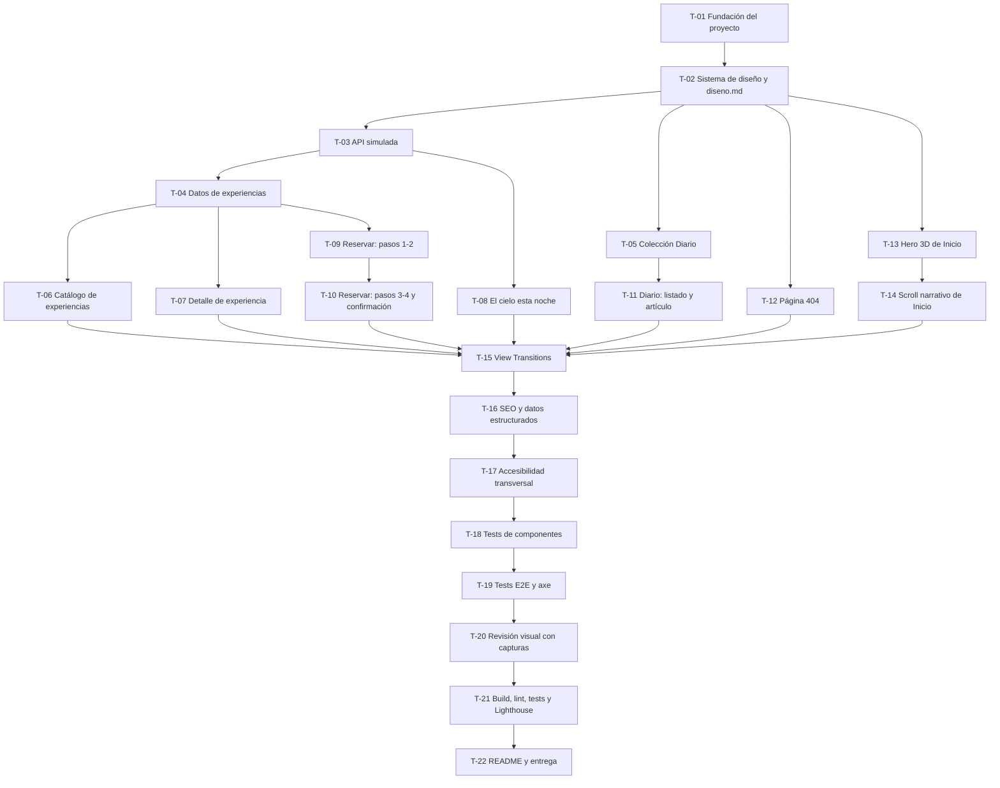

# Plan de tareas — Umbra

Fuente: [`spec.md`](./spec.md). Plan de diseño: `docs/diseno.md` (se escribe en T-02, antes de
construir ninguna pantalla).

## Fases

## Matriz de cobertura

| Requisito           | Tareas     |
| ------------------- | ---------- |
| RF-01               | T-13, T-14 |
| RF-02, RF-03        | T-06       |
| RF-04               | T-07       |
| RF-05, RF-06, RF-07 | T-09, T-10 |
| RF-08, RF-09        | T-08       |
| RF-10               | T-05, T-11 |
| RF-11               | T-02       |
| RF-12               | T-12       |
| RNF rendimiento/SEO | T-16, T-21 |
| RNF accesibilidad   | T-17, T-19 |

**Primera tarea recomendada:** T-01.

---

### T-01 · Fundación del proyecto

**Fase:** 1 · Fundación **Depende de:** — **Tamaño:** M (≈1 día)
**Cubre:** base técnica de todos los RF

**Objetivo:** Tener un proyecto Astro + TypeScript estricto arrancable, con Tailwind, linters y
estructura de carpetas, listo para recibir páginas y componentes.

**Alcance:**

- `npm create astro@latest` (plantilla mínima, TypeScript estricto), integración de React
  (`@astrojs/react`), Tailwind (`@astrojs/tailwind`), sitemap (`@astrojs/sitemap`).
- ESLint + Prettier configurados para `.astro`, `.ts`, `.tsx`; script `lint` y `format`.
- Vitest + Testing Library y Playwright instalados (configuración mínima, sin tests todavía).
- Estructura: `src/pages`, `src/layouts`, `src/components`, `src/islands`, `src/lib/api`,
  `src/data`, `src/content`, `src/styles`, `tests/unit`, `tests/e2e`.
- `git init` (si no existe) y primer commit.

**Fuera de alcance:** tokens de diseño (T-02), contenido real (T-04, T-05).

**Archivos o módulos afectados:** raíz del proyecto, `astro.config.mjs`, `tsconfig.json`,
`package.json`, `.eslintrc`, `.prettierrc`.

**Hecho cuando:**

- [ ] `npm run dev` arranca sin errores.
- [ ] `npm run build` termina en verde.
- [ ] `npm run lint` se ejecuta sin errores de configuración (puede no haber código que revisar aún).

**Verificación:** `npm run build && npm run lint`.

**Skill a usar:** skill-diseño-y-codigo-frontend (`references/stack.md`, `references/herramientas.md`).

---

### T-02 · Sistema de diseño, plan de diseño y layout base

**Fase:** 1 · Fundación **Depende de:** T-01 **Tamaño:** M (≈1 día)
**Cubre:** RF-11, base visual de todos los RF

**Objetivo:** Escribir `docs/diseno.md` con la paleta, tipografía y wireframes, y traducirlo a
tokens reales (Tailwind config + variables CSS), con el layout base (header, nav, footer) y el
selector de tema persistente.

**Alcance:**

- `docs/diseno.md`: paleta con valores OKLCH/hex y contraste comprobado, tipografías (Fontsource),
  escala fluida, wireframe ASCII de cada página, perfil de animación y momento estrella de cada
  página.
- Tokens en `tailwind.config.ts` y `src/styles/tokens.css`, con variante oscura rediseñada (no
  invertida) vía `[data-theme="dark"]` y `prefers-color-scheme`.
- `src/layouts/LayoutBase.astro`: `<head>` con metadatos base, fuentes autoalojadas, enlace "Saltar
  al contenido", header con navegación, footer, `<ClientRouter />` para View Transitions.
- Selector de tema (isla React mínima o script inline) que respeta el sistema por defecto y
  persiste la elección (RF-11, CA-11.1, CA-11.2).

**Fuera de alcance:** contenido de páginas concretas.

**Archivos o módulos afectados:** `docs/diseno.md`, `tailwind.config.ts`, `src/styles/`,
`src/layouts/LayoutBase.astro`, `src/components/SelectorTema.tsx`.

**Hecho cuando:**

- [ ] `docs/diseno.md` existe y pasa la revisión de la skill (nada genérico).
- [ ] Contraste texto/fondo ≥ 4,5:1 comprobado para los pares principales, documentado en
      `diseno.md`.
- [ ] El selector de tema cambia el tema y lo recuerda al recargar (CA-11.2).

**Verificación:** inspección manual en navegador con el sistema en claro y en oscuro; `npm run build`.

**Skill a usar:** skill-diseño-y-codigo-frontend (`references/color-tipografia.md`).

---

### T-03 · API simulada

**Fase:** 1 · Fundación **Depende de:** T-01 **Tamaño:** M (≈1 día)
**Cubre:** contrato de la sección 9 de `spec.md`

**Objetivo:** Un módulo `src/lib/api/` con tipos TypeScript y funciones que imitan un backend real:
latencia artificial, formato `{ data, meta }` en listados y errores Problem Details, con un modo de
fallo activable por `?simular=error`.

**Alcance:**

- `src/lib/api/tipos.ts`: tipos `Experiencia`, `Disponibilidad`, `Reserva`, `CieloEstaNoche`,
  `ProblemDetails`.
- `src/lib/api/cliente.ts`: helper `simularLatencia()`, `debeSimularError()` (lee el parámetro de
  la URL actual) y `crearError()`.
- `src/lib/api/experiencias.ts`: `listarExperiencias`, `obtenerExperiencia`,
  `obtenerDisponibilidad`.
- `src/lib/api/reservas.ts`: `crearReserva` con las reglas RN-01 a RN-04.
- `src/lib/api/cielo.ts`: `obtenerCieloEstaNoche`.

**Fuera de alcance:** los datos reales de experiencias (T-04) y del cielo (puede usar datos
provisionales que T-04/T-08 completen).

**Archivos o módulos afectados:** `src/lib/api/**`.

**Hecho cuando:**

- [ ] Cada función devuelve una `Promise` que resuelve tras 300-900 ms.
- [ ] Con `?simular=error` en la URL, cada función rechaza con un objeto `ProblemDetails`.
- [ ] `crearReserva` rechaza con 409 si `plazas` pedidas > `plazas_libres` (RN-01).

**Verificación:** `npm run test:unit -- api` (tests añadidos en T-18) y prueba manual desde la
consola del navegador.

**Skill a usar:** habilidad-backend (`references/api-rest.md`, `references/errores-validacion.md`).

---

### T-04 · Datos de experiencias y disponibilidad

**Fase:** 2 · Datos **Depende de:** T-03 **Tamaño:** S (≤ media jornada)
**Cubre:** modelo de datos de Experiencia y Disponibilidad (sección 7)

**Objetivo:** Contenido realista y específico de 6 experiencias de Umbra, con disponibilidad
simulada para 30 días.

**Alcance:**

- `src/data/experiencias.ts`: 6 experiencias (observación en familia, astrofotografía para
  principiantes, observación de planetas y luna llena, escapada nocturna en pareja, caza de la Vía
  Láctea, taller infantil "Pequeños astrónomos"), con todos los campos del modelo de datos.
- `src/data/disponibilidad.ts`: generador determinista de plazas libres por experiencia y fecha
  para los próximos 30 días (con alguna fecha a 0 plazas para poder ver CA-05.2).

**Fuera de alcance:** UI que consuma estos datos (T-06, T-07, T-09).

**Archivos o módulos afectados:** `src/data/experiencias.ts`, `src/data/disponibilidad.ts`.

**Hecho cuando:**

- [ ] 6 experiencias con textos sin genéricos ni "lorem ipsum", precios y horarios coherentes entre
      sí (p. ej. una experiencia de 2 h no puede tener una franja de 5 h).
- [ ] Al menos una combinación experiencia/fecha con `plazas_libres: 0`.

**Verificación:** `listarExperiencias()` desde la consola devuelve las 6; revisión de textos.

**Skill a usar:** skill-diseño-y-codigo-frontend (contenido realista, sección 5 del flujo).

---

### T-05 · Colección de contenido del Diario

**Fase:** 2 · Datos **Depende de:** T-02 **Tamaño:** S (≤ media jornada)
**Cubre:** modelo de datos de Artículo, RF-10

**Objetivo:** Al menos 3 artículos reales y bien escritos en una colección de contenido de Astro.

**Alcance:**

- `src/content/config.ts`: esquema Zod de la colección `diario` (título, resumen, fecha, autor,
  categoría, imagen de portada como componente SVG o gradiente, cuerpo en Markdown).
- 3-4 artículos en `src/content/diario/*.md`, con temas propios de Umbra (p. ej. "Cómo fotografiar
  la Vía Láctea con un móvil moderno", "Guía para entender la fase lunar antes de reservar", "Qué
  ver en el cielo de otoño desde Gredos", "Por qué la altitud del Collado del Cielo importa").

**Fuera de alcance:** las páginas que renderizan la colección (T-11).

**Archivos o módulos afectados:** `src/content/config.ts`, `src/content/diario/*.md`.

**Hecho cuando:**

- [ ] `getCollection('diario')` devuelve ≥ 3 artículos válidos contra el esquema.
- [ ] Cada artículo tiene ≥ 600 palabras de contenido real y específico.

**Verificación:** `npm run build` (Astro valida el esquema de contenido en build).

**Skill a usar:** skill-diseño-y-codigo-frontend (`references/stack.md`, sección Astro).

---

### T-06 · Página Experiencias: catálogo con filtros y orden

**Fase:** 3 · Funcionalidades **Depende de:** T-04 **Tamaño:** M (≈1 día)
**Cubre:** RF-02, RF-03, CA-02.1, CA-02.2, CA-02.3

**Objetivo:** `/experiencias` muestra el catálogo con filtros (tipo, duración, precio, apto para
niños) y orden (precio, duración), en una isla de React con los 4 estados de interfaz.

**Alcance:**

- `src/pages/experiencias/index.astro`: SEO de la página + monta la isla.
- `src/islands/CatalogoExperiencias.tsx` (`client:load`): estado de filtros en la URL
  (`URLSearchParams`), llama a `listarExperiencias`, estados cargando (skeletons)/vacío/error/con
  datos.
- `src/components/TarjetaExperiencia.astro` (o `.tsx` si lo usa la isla) para cada resultado.

**Fuera de alcance:** página de detalle (T-07).

**Archivos o módulos afectados:** `src/pages/experiencias/index.astro`,
`src/islands/CatalogoExperiencias.tsx`, `src/components/TarjetaExperiencia.*`.

**Hecho cuando:**

- [ ] CA-02.1, CA-02.2 y CA-02.3 se cumplen manualmente.
- [ ] Los 4 estados (cargando, vacío, error con `?simular=error`, con datos) están implementados y
      se han visto en el navegador.
- [ ] Perfil de animación EXPRESIVO aplicado según `diseno.md` (sin más de un momento destacado).

**Verificación:** prueba manual con cada filtro y con `?simular=error`; test E2E en T-19.

**Skill a usar:** skill-diseño-y-codigo-frontend (`references/integracion-api.md`).

---

### T-07 · Página de detalle de experiencia

**Fase:** 3 · Funcionalidades **Depende de:** T-04 **Tamaño:** S (≤ media jornada)
**Cubre:** RF-04

**Objetivo:** `/experiencias/[id]` muestra galería, qué incluye, horarios y preguntas frecuentes de
una experiencia, con CTA a "Reservar" preseleccionándola.

**Alcance:**

- `src/pages/experiencias/[id].astro` con `getStaticPaths` sobre `src/data/experiencias.ts`.
- Galería como composición de SVG/CSS (sin fotos con derechos de autor).
- Acordeón de preguntas frecuentes accesible (usa `
`/`
` nativos).
- Enlace "Reservar esta experiencia" → `/reservar?experiencia=<id>`.
- 404 si el `id` no existe en los datos.

**Fuera de alcance:** el formulario de reserva en sí (T-09).

**Archivos o módulos afectados:** `src/pages/experiencias/[id].astro`,
`src/components/GaleriaExperiencia.astro`, `src/components/Faq.astro`.

**Hecho cuando:**

- [ ] Cada una de las 6 experiencias tiene su página de detalle completa.
- [ ] El acordeón de FAQ es operable con teclado sin JavaScript adicional.

**Verificación:** navegar a las 6 URLs de detalle; `npm run build`.

**Skill a usar:** skill-diseño-y-codigo-frontend.

---

### T-08 · Página "El cielo esta noche"

**Fase:** 3 · Funcionalidades **Depende de:** T-03 **Tamaño:** M (≈1 día)
**Cubre:** RF-08, RF-09, CA-08.1 a CA-08.4

**Objetivo:** `/el-cielo-esta-noche` muestra fase lunar, visibilidad, planetas visibles y próximos
eventos, con los 4 estados de interfaz.

**Alcance:**

- `src/pages/el-cielo-esta-noche.astro` + `src/islands/PanelCielo.tsx` (`client:load`).
- Datos simulados de `obtenerCieloEstaNoche` completados en `src/lib/api/cielo.ts` (fase lunar
  calculada de forma determinista a partir de la fecha, no aleatoria en cada carga).
- Botón "Reintentar" que repite la petición tras un error (CA-08.3).

**Fuera de alcance:** cálculo astronómico real (los datos son simulados pero verosímiles).

**Archivos o módulos afectados:** `src/pages/el-cielo-esta-noche.astro`,
`src/islands/PanelCielo.tsx`, `src/lib/api/cielo.ts`.

**Hecho cuando:**

- [ ] Los 4 estados se han visto en el navegador (cargando, vacío en eventos, error, con datos).
- [ ] Perfil SUTIL: sin animaciones de scroll, solo skeleton y transiciones de estado.

**Verificación:** prueba manual con `?simular=error`; test E2E en T-19.

**Skill a usar:** skill-diseño-y-codigo-frontend (`references/integracion-api.md`).

---

### T-09 · Reservar: pasos 1 y 2 (experiencia, fecha y plazas)

**Fase:** 3 · Funcionalidades **Depende de:** T-04 **Tamaño:** M (≈1 día)
**Cubre:** parte de RF-05, CA-05.1, CA-05.2, RN-01, RN-04

**Objetivo:** Los dos primeros pasos del asistente de reserva, con la máquina de estados del
formulario ya montada para los pasos siguientes.

**Alcance:**

- `src/pages/reservar.astro` + `src/islands/AsistenteReserva.tsx` (`client:load`), con estado del
  paso actual y de los datos acumulados (sin librería externa de formularios: el estado cabe en
  `useReducer`).
- Paso 1: selector de experiencia (preseleccionada si llega `?experiencia=` en la URL).
- Paso 2: selector de fecha (próximos 30 días) y plazas (1-8, RN-04), consultando
  `obtenerDisponibilidad`; deshabilita plazas si `plazas_libres === 0` (CA-05.2).
- Indicador de progreso de 4 pasos, accesible (`aria-current`).

**Fuera de alcance:** pasos 3 y 4 (T-10).

**Archivos o módulos afectados:** `src/pages/reservar.astro`, `src/islands/AsistenteReserva.tsx`,
`src/components/IndicadorPasos.tsx`.

**Hecho cuando:**

- [ ] CA-05.1 y CA-05.2 se cumplen manualmente.
- [ ] Se puede navegar del paso 1 al 2 y volver sin perder los datos ya introducidos.

**Verificación:** prueba manual completa de los pasos 1-2.

**Skill a usar:** skill-diseño-y-codigo-frontend (`references/integracion-api.md`, formularios).

---

### T-10 · Reservar: pasos 3 y 4, envío y confirmación

**Fase:** 3 · Funcionalidades **Depende de:** T-09 **Tamaño:** M (≈1 día)
**Cubre:** resto de RF-05, RF-06, RF-07, CA-05.3 a CA-05.6

**Objetivo:** Completar el asistente con datos personales, resumen, envío a `crearReserva` y
pantalla de confirmación.

**Alcance:**

- Paso 3: nombre, email, teléfono, comentarios opcionales; validación al salir del campo (`onBlur`)
  y al enviar, con `aria-describedby` y foco al primer error (CA-05.3, CA-05.4).
- Paso 4: resumen de los datos de los 3 pasos anteriores, checkbox de política de cancelación,
  botón "Confirmar reserva" que llama a `crearReserva`, se deshabilita durante el envío y muestra
  el error de la API si falla (CA-05.5, CA-05.6).
- Pantalla/estado de confirmación con el localizador devuelto y un resumen de la reserva.

**Fuera de alcance:** persistencia real de la reserva (no existe backend, sección 2 de `spec.md`).

**Archivos o módulos afectados:** `src/islands/AsistenteReserva.tsx`,
`src/components/PasoDatos.tsx`, `src/components/PasoResumen.tsx`,
`src/components/ConfirmacionReserva.tsx`.

**Hecho cuando:**

- [ ] CA-05.3 a CA-05.6 se cumplen manualmente y con test E2E (T-19).
- [ ] El formulario sigue siendo enviable (con validación nativa del navegador) si JavaScript está
      desactivado, degradando a un `<form method="post">` que muestra un mensaje explicando que la
      reserva online requiere JavaScript en este prototipo.

**Verificación:** prueba manual completa del asistente, con y sin `?simular=error`.

**Skill a usar:** skill-diseño-y-codigo-frontend (`references/integracion-api.md`).

---

### T-11 · Diario: listado y artículo

**Fase:** 3 · Funcionalidades **Depende de:** T-05 **Tamaño:** S (≤ media jornada)
**Cubre:** RF-10

**Objetivo:** `/diario` lista los artículos y `/diario/[slug]` muestra uno con buena tipografía de
lectura, tiempo de lectura estimado e índice.

**Alcance:**

- `src/pages/diario/index.astro`: listado ordenado por fecha descendente, con categoría y resumen.
- `src/pages/diario/[slug].astro`: render del Markdown, cálculo de tiempo de lectura (palabras/200),
  índice generado a partir de los encabezados del artículo.
- Tipografía de lectura: `max-width: 65ch`, interlineado 1,6.

**Fuera de alcance:** comentarios o compartir en redes.

**Archivos o módulos afectados:** `src/pages/diario/index.astro`, `src/pages/diario/[slug].astro`,
`src/lib/tiempoLectura.ts`.

**Hecho cuando:**

- [ ] Los artículos de T-05 se listan y se leen completos.
- [ ] El índice enlaza a cada sección del artículo (anclas).

**Verificación:** navegar el listado y cada artículo; `npm run build`.

**Skill a usar:** skill-diseño-y-codigo-frontend.

---

### T-12 · Página 404

**Fase:** 3 · Funcionalidades **Depende de:** T-02 **Tamaño:** S (≤ media jornada)
**Cubre:** RF-12, CA-12.1

**Objetivo:** `src/pages/404.astro` con el mismo sistema de diseño y humor sutil del tema.

**Alcance:** ilustración SVG del cielo con una "estrella perdida", mensaje breve, enlaces a
"Inicio" y "Experiencias".

**Fuera de alcance:** ninguno.

**Archivos o módulos afectados:** `src/pages/404.astro`.

**Hecho cuando:**

- [ ] Una URL inexistente responde 404 (comprobado en `npm run preview`) y muestra la página.

**Verificación:** `npm run build && npm run preview`, visitar una URL inexistente.

**Skill a usar:** skill-diseño-y-codigo-frontend.

---

### T-13 · Hero 3D de Inicio

**Fase:** 4 · Momento estrella **Depende de:** T-02 **Tamaño:** M (≈1 día)
**Cubre:** RF-01 (parte 3D)

**Objetivo:** Escena Three.js en el hero de Inicio (cielo estrellado con una constelación que
reacciona al ratón y al scroll), con alternativa estática accesible.

**Alcance:**

- `src/islands/HeroEscena3D.tsx` (`client:visible`), campo de estrellas + una constelación
  dibujada con líneas, rotación sutil ligada a la posición del ratón y al scroll inicial.
- Alternativa: si `prefers-reduced-motion: reduce`, o `navigator.hardwareConcurrency <= 2`, se
  renderiza una versión estática (SVG/CSS) en su lugar, sin cargar Three.js.
- Límite de `devicePixelRatio` a 2, pausa del render cuando la sección no es visible
  (`IntersectionObserver`).

**Fuera de alcance:** el scroll narrativo posterior (T-14).

**Archivos o módulos afectados:** `src/islands/HeroEscena3D.tsx`,
`src/components/HeroEscenaEstatica.astro`, `src/pages/index.astro`.

**Hecho cuando:**

- [ ] Con movimiento reducido activado, se ve la alternativa estática y no se descarga Three.js
      (comprobado en la pestaña Red del navegador).
- [ ] La escena reacciona al mover el ratón (escritorio) y no se ejecuta fuera de pantalla.

**Verificación:** prueba manual en escritorio y con movimiento reducido activado en el sistema.

**Skill a usar:** skill-diseño-y-codigo-frontend (`references/animaciones.md`, perfil espectacular).

---

### T-14 · Scroll narrativo de Inicio

**Fase:** 4 · Momento estrella **Depende de:** T-13 **Tamaño:** M (≈1 día)
**Cubre:** RF-01 (parte scroll narrativo)

**Objetivo:** Sección fijada con GSAP + ScrollTrigger que cuenta "del atardecer a la noche
cerrada", con la paleta transicionando a la vez.

**Alcance:**

- `src/islands/ScrollNarrativo.tsx` (`client:visible`), 3-4 fases (atardecer → anochecer → noche
  cerrada → cielo estrellado) con pin de sección y cambio de variables CSS de color de fondo por
  fase.
- `gsap.matchMedia()` con rama `(prefers-reduced-motion: no-preference)`; bajo movimiento reducido,
  las fases se muestran como secciones normales sin pin ni scrub.
- El resto de Inicio (experiencias destacadas, CTA final) se mantiene discreto (perfil sutil),
  respetando la regla de un único momento estrella por página junto al hero.

**Fuera de alcance:** contenido de otras páginas.

**Archivos o módulos afectados:** `src/islands/ScrollNarrativo.tsx`, `src/pages/index.astro`,
`src/styles/tokens.css` (variables de fase).

**Hecho cuando:**

- [ ] La secuencia se fija y avanza con el scroll en escritorio.
- [ ] Con movimiento reducido, el contenido se lee sin pin ni scrub.
- [ ] En móvil, la coreografía se simplifica (menos fases o transición más corta) sin romper el
      layout.

**Verificación:** prueba manual en escritorio, móvil (vista de dispositivo) y movimiento reducido.

**Skill a usar:** skill-diseño-y-codigo-frontend (`references/animaciones.md`).

---

### T-15 · View Transitions entre páginas

**Fase:** 5 · Transversales **Depende de:** T-06, T-07, T-08, T-10, T-11, T-12, T-14
**Tamaño:** S (≤ media jornada)
**Cubre:** requisito transversal de transiciones

**Objetivo:** Navegación entre páginas con `<ClientRouter />` de Astro y transiciones con nombre en
los elementos clave (logo, imagen de hero de experiencia).

**Alcance:** `<ClientRouter />` en `LayoutBase.astro` (si no se añadió ya en T-02), atributos
`transition:name` en cabeceras de experiencia y logo, fallback sin transición si el navegador no
lo soporta.

**Fuera de alcance:** transiciones dentro del asistente de reserva (ya cubiertas por su propia
lógica de pasos).

**Archivos o módulos afectados:** `src/layouts/LayoutBase.astro`, páginas con `transition:name`.

**Hecho cuando:**

- [ ] Navegar entre Inicio → Experiencias → Detalle no provoca parpadeo brusco en navegadores
      compatibles y sigue funcionando (sin transición) en los que no.

**Verificación:** prueba manual navegando por la web.

**Skill a usar:** skill-diseño-y-codigo-frontend (`references/stack.md`, sección Astro).

---

### T-16 · SEO y datos estructurados

**Fase:** 5 · Transversales **Depende de:** T-15 **Tamaño:** M (≈1 día)
**Cubre:** RNF de SEO (sección 11)

**Objetivo:** Metadatos y Open Graph únicos por página, JSON-LD, sitemap y robots.txt.

**Alcance:**

- Componente `src/components/Seo.astro` (título, descripción, canonical, OG, Twitter card)
  recibido como props desde cada página.
- JSON-LD `LocalBusiness` en `LayoutBase.astro`; `Event` en cada página de detalle de experiencia;
  `Article` en cada página de artículo del diario.
- `@astrojs/sitemap` configurado; `public/robots.txt` apuntando al sitemap.

**Fuera de alcance:** imagen OG personalizada por página (se usa una imagen OG genérica generada
en SVG para todas las páginas, aceptable para esta demo).

**Archivos o módulos afectados:** `src/components/Seo.astro`, `src/layouts/LayoutBase.astro`,
`astro.config.mjs`, `public/robots.txt`.

**Hecho cuando:**

- [ ] Cada página tiene `<title>` y `<meta name="description">` distintos.
- [ ] `npm run build` genera `sitemap-index.xml`.
- [ ] El JSON-LD valida sin errores en un validador de schema.org (revisión manual del JSON).

**Verificación:** `npm run build`; inspección del HTML generado.

**Skill a usar:** skill-diseño-y-codigo-frontend (`references/seo.md`).

---

### T-17 · Accesibilidad transversal

**Fase:** 5 · Transversales **Depende de:** T-16 **Tamaño:** M (≈1 día)
**Cubre:** RNF de accesibilidad (sección 11)

**Objetivo:** Pasar la checklist de accesibilidad de la skill en todas las páginas.

**Alcance:**

- Revisión y corrección: jerarquía de encabezados, `:focus-visible` propio en todos los elementos
  interactivos, `alt` en imágenes/SVG informativos y `alt=""` en decorativos, enlace "Saltar al
  contenido" operativo, `aria-label` en botones solo con icono.
- Verificación de contraste real con los tokens ya construidos (no solo el plan de `diseno.md`).

**Fuera de alcance:** los tests automáticos de axe (T-19, que verifican esta tarea).

**Archivos o módulos afectados:** transversal a `src/components/`, `src/layouts/`,
`src/styles/tokens.css`.

**Hecho cuando:**

- [ ] Navegación completa de las 6 páginas solo con teclado, sin quedar atrapado en ningún
      componente.
- [ ] Todos los pares de color usados para texto cumplen el contraste mínimo.

**Verificación:** prueba manual con teclado; se confirma con axe en T-19.

**Skill a usar:** skill-diseño-y-codigo-frontend (`references/calidad.md`).

---

### T-18 · Tests de componentes

**Fase:** 6 · Calidad **Depende de:** T-17 **Tamaño:** M (≈1 día)
**Cubre:** verificación de RF-02, RF-05, RF-08 y del contrato de la API simulada

**Objetivo:** Cobertura de Vitest + Testing Library sobre la lógica más sensible: API simulada,
catálogo y formulario de reserva.

**Alcance:**

- `tests/unit/api/*.test.ts`: latencia, formato de error, formato paginado, reglas RN-01/RN-04.
- `tests/unit/CatalogoExperiencias.test.tsx`: filtra y ordena, muestra estado vacío y de error.
- `tests/unit/AsistenteReserva.test.tsx`: validación de campos, bloqueo del botón durante el envío,
  mensaje de error de la API.

**Fuera de alcance:** flujos de extremo a extremo (T-19).

**Archivos o módulos afectados:** `tests/unit/**`, `vitest.config.ts`.

**Hecho cuando:**

- [ ] `npm run test:unit` pasa en verde.
- [ ] Los criterios CA-02.1 a CA-02.3 y CA-05.3 a CA-05.6 tienen al menos un test que los cubre.

**Verificación:** `npm run test:unit`.

**Skill a usar:** skill-diseño-y-codigo-frontend (`references/herramientas.md`).

---

### T-19 · Tests E2E y accesibilidad automática

**Fase:** 6 · Calidad **Depende de:** T-18 **Tamaño:** M (≈1 día)
**Cubre:** verificación de extremo a extremo de RF-02, RF-05, RF-08, RF-11, RF-12

**Objetivo:** Flujos clave probados con Playwright, incluido un viewport móvil, y verificación
automática de accesibilidad con axe.

**Alcance:**

- `tests/e2e/reserva.spec.ts`: completa el asistente de principio a fin (éxito) y el caso de error
  simulado.
- `tests/e2e/catalogo.spec.ts`: filtra y comprueba el estado vacío.
- `tests/e2e/cielo.spec.ts`: estado de error y reintentar.
- `tests/e2e/tema.spec.ts`: cambia de tema y comprueba persistencia tras recargar.
- `tests/e2e/accesibilidad.spec.ts`: `@axe-core/playwright` sobre Inicio, Experiencias, Reservar,
  El cielo esta noche, Diario y 404.
- Proyecto de Playwright con un dispositivo móvil (p. ej. "iPhone 13") además de escritorio.

**Fuera de alcance:** pruebas de carga o rendimiento (T-21 usa Lighthouse para eso).

**Archivos o módulos afectados:** `tests/e2e/**`, `playwright.config.ts`.

**Hecho cuando:**

- [ ] `npm run test:e2e` pasa en verde en escritorio y en el proyecto móvil.
- [ ] Axe no reporta violaciones de impacto "serious" o "critical" en ninguna página analizada.

**Verificación:** `npm run test:e2e`.

**Skill a usar:** skill-diseño-y-codigo-frontend (`references/herramientas.md`).

---

### T-20 · Revisión visual con capturas

**Fase:** 6 · Calidad **Depende de:** T-19 **Tamaño:** S (≤ media jornada)
**Cubre:** control de calidad visual frente a `diseno.md`

**Objetivo:** Capturar con Playwright cada página en móvil y escritorio, claro y oscuro, y corregir
lo que no encaje con el plan de diseño.

**Alcance:** script o test de Playwright que recorre las 6 páginas × 2 anchos × 2 temas y guarda
capturas en `tests/e2e/.capturas/` (no versionadas); revisión manual de cada una y ajustes de CSS
donde haga falta.

**Fuera de alcance:** rediseño completo; solo ajustes puntuales.

**Archivos o módulos afectados:** variable, según lo que la revisión encuentre.

**Hecho cuando:**

- [ ] Las 24 capturas se han revisado una a una contra `diseno.md`.
- [ ] No quedan problemas evidentes de contraste, recorte de contenido o solapamiento en ningún
      combinación de ancho/tema.

**Verificación:** inspección manual de las capturas.

**Skill a usar:** skill-diseño-y-codigo-frontend (`references/calidad.md`, paso 6 del flujo).

---

### T-21 · Build, lint, tests y Lighthouse

**Fase:** 6 · Calidad **Depende de:** T-20 **Tamaño:** S (≤ media jornada)
**Cubre:** RNF de rendimiento (sección 11)

**Objetivo:** Confirmar que todo el proyecto está en verde y que el rendimiento cumple el
objetivo antes de entregar.

**Alcance:** ejecutar build, lint y toda la batería de tests; ejecutar Lighthouse (CLI o DevTools)
sobre Inicio, Experiencias y Reservar en modo escritorio y móvil; corregir lo que quede por debajo
de 90 en cualquier categoría.

**Fuera de alcance:** nuevas funcionalidades.

**Archivos o módulos afectados:** el que requiera cada hallazgo de Lighthouse.

**Hecho cuando:**

- [ ] `npm run build`, `npm run lint`, `npm run test:unit` y `npm run test:e2e` en verde.
- [ ] Lighthouse ≥ 90 en las 4 categorías, en las 3 páginas medidas, en escritorio y móvil (o, si
      alguna queda por debajo, está documentado el motivo en el README).

**Verificación:** los comandos anteriores + informe de Lighthouse.

**Skill a usar:** skill-diseño-y-codigo-frontend (`references/herramientas.md`).

---

### T-22 · README y entrega

**Fase:** 6 · Calidad **Depende de:** T-21 **Tamaño:** S (≤ media jornada)
**Cubre:** entrega del proyecto

**Objetivo:** Documentar el proyecto para que cualquiera pueda arrancarlo y entender las
decisiones.

**Alcance:** `README.md` con qué es el proyecto, cómo arrancarlo, estructura de carpetas explicada,
cómo activar los estados de error simulados (`?simular=error`), decisiones de diseño y tecnología
con su porqué (enlazando a `docs/diseno.md` y a la sección 12 de `spec.md`).

**Archivos o módulos afectados:** `README.md`.

**Hecho cuando:**

- [ ] Un desarrollador nuevo puede clonar, instalar y arrancar el proyecto solo con el README.

**Verificación:** seguir el README desde cero en una terminal limpia.

**Skill a usar:** skill-diseño-y-codigo-frontend (paso 7, entrega).
